# 🤖 REFLEX - Research Engine with Feedback-Driven Learning

A functional proof-of-concept demonstrating a self-improving AI agent using **Reinforcement Learning**, **RAG (Retrieval Augmented Generation)**, and **Agno v2** framework with a modern web interface.


## ✨ Features

### 🧠 Agent Capabilities
- **Self-Improvement with RL**: Learns from feedback using GRPO-style reinforcement learning
- **Skill Library**: Accumulates and reuses learned skills across tasks
- **RAG with Vector DB**: LanceDB-powered knowledge retrieval
- **Web Search**: DuckDuckGo integration for current information
- **Persistent Memory**: SQLite storage for conversation history
- **Session Management**: Multi-user, multi-session support

### 🎨 Modern UI/UX
- **Real-time Chat**: Streaming responses with live updates
- **Training Dashboard**: Visual metrics and performance tracking
- **Skill Visualization**: Interactive skill library browser
- **Feedback System**: Intuitive reward mechanism
- **Dark/Light Mode**: Theme toggle with localStorage persistence
- **Dark/Light Mode**: Theme toggle with localStorage persistence
- **Responsive Design**: Works on desktop and mobile
- **Thinking Process UI**: Visualize agent's internal reasoning steps
- **Temporal Awareness**: Agent knows current date and time for accurate research

### 🔧 Technical Stack
- **Backend**: FastAPI + Python 3.10+
- **Agent Framework**: Agno v2 (Dec 2025)
- **LLM**: Claude Sonnet 4
- **Vector DB**: LanceDB with hybrid search
- **Storage**: SQLite for sessions and memory
- **Security**: 
  - Rate limiting (slowapi)
  - XSS protection (DOMPurify)
  - Input validation (Pydantic)
  - CORS strict origin policies
- **Frontend**: Pure HTML/CSS/JavaScript (no framework overhead)

## 🚀 Quick Start

### Prerequisites

```bash
# Required
- Python 3.10 or higher
- pip (Python package manager)
- API Keys:
  - Anthropic API key (for Claude)
  - OpenAI API key (for embeddings)

# Optional but recommended
- Git
- Virtual environment tool
```

### Installation

#### 1. Clone or Download

```bash
# Option A: Clone repository
git clone <your-repo-url>
cd REFLEX

# Option B: Download and extract ZIP
# Then navigate to the directory
```

#### 2. Project Structure

The project structure is already set up:

```
REFLEX/
├── backend/
│   ├── main.py
│   ├── agent_core.py
│   ├── models.py
│   ├── requirements.txt
│   └── .env
├── frontend/
│   ├── index.html
│   ├── styles.css
│   └── app.js
├── data/
│   ├── skills/
│   └── db/
├── run.sh
└── README.md
```

#### 3. Backend Setup

```bash
cd backend

# Create virtual environment
python3 -m venv venv

# Activate virtual environment
# On macOS/Linux:
source venv/bin/activate
# On Windows:
venv\Scripts\activate

# Install dependencies
pip install -r requirements.txt
```

**backend/requirements.txt**:
```txt
fastapi==0.115.0
uvicorn[standard]==0.32.0
agno==2.3.12
anthropic==0.39.0
openai==1.54.0
duckduckgo-search==6.3.5
lancedb==0.16.0
numpy==1.26.4
python-dotenv==1.0.1
pydantic==2.10.2
websockets==14.1
```

#### 4. Configure Environment

Create `backend/.env`:

```bash
ANTHROPIC_API_KEY=your_anthropic_api_key_here
OPENAI_API_KEY=your_openai_api_key_here
```

**Get API Keys:**
- Anthropic: https://console.anthropic.com/
- OpenAI: https://platform.openai.com/api-keys

#### 5. Run the Application

**Option A: Using run script (macOS/Linux)**

```bash
chmod +x run.sh
./run.sh
```

**Option B: Manual start**

Terminal 1 (Backend):
```bash
cd backend
source venv/bin/activate  # or venv\Scripts\activate on Windows
uvicorn main:app --reload --host 0.0.0.0 --port 8000
```

Terminal 2 (Frontend):
```bash
cd frontend
python3 -m http.server 3000
# Or use any other static file server
```

#### 6. Access the Application

- **Frontend UI**: http://localhost:3000
- **Backend API**: http://localhost:8000
- **API Docs**: http://localhost:8000/docs (Interactive Swagger UI)
- **Health Check**: http://localhost:8000/api/health

## 📖 Usage Guide

### Basic Workflow

1. **Ask Questions**
   - Type your research question in the chat input
   - Examples:
     - "What is GRPO in reinforcement learning?"
     - "Explain self-improving AI agents"
     - "Compare GSPO and PPO algorithms"

2. **Receive Responses**
   - Agent searches web and knowledge base
   - Applies relevant learned skills
   - Streams response in real-time
   - Shows tools and skills used

3. **Provide Feedback**
   - Use sliders to rate response quality
   - Optionally create a skill from the interaction
   - Submit feedback to improve the agent

4. **Monitor Progress**
   - View live training metrics in sidebar
   - Check top performing skills
   - Track success rate and rewards

5. **Trigger Training**
   - Click "Trigger Training" to run RL update
   - Agent improves based on collected feedback
   - Skills are updated with new success rates

### Feedback System

**Sliders:**
- **Task Success** (0-1): How well did the agent complete the task?
- **Quality** (0-1): How good was the response quality?
- **Efficiency** (0-1): How efficient was the agent?
- **User Feedback** (-1 to 1): Your overall satisfaction

**Creating Skills:**
1. Check "Create Skill" checkbox
2. Fill in:
   - **Skill Name**: Short identifier (e.g., "grpo_research")
   - **Description**: What the skill does
   - **Context**: How to apply the skill
3. Submit feedback

**Skill Example:**
```
Name: reinforcement_learning_research
Description: Research RL algorithms and compare approaches
Context: Use web search for recent papers, compare algorithmic details
```

### API Usage

**Chat Request:**
```bash
curl -X POST http://localhost:8000/api/chat \
  -H "Content-Type: application/json" \
  -d '{
    "message": "What is GRPO?",
    "session_id": "session_1",
    "user_id": "user_123"
  }'
```

**Submit Feedback:**
```bash
curl -X POST http://localhost:8000/api/feedback \
  -H "Content-Type: application/json" \
  -d '{
    "session_id": "session_1",
    "task_success": 0.9,
    "quality_score": 0.85,
    "efficiency_score": 0.8,
    "user_feedback": 1.0
  }'
```

**View Stats:**
```bash
curl http://localhost:8000/api/stats
```

**List Skills:**
```bash
curl http://localhost:8000/api/skills
```

## 📚 Core Concepts & Technologies

This section explains the fundamental concepts and technologies used in REFLEX, why we chose them, and how they work together to create a self-improving research agent.

### 🤖 Artificial Intelligence (AI)

**What is AI?**
Artificial Intelligence refers to computer systems that can perform tasks typically requiring human intelligence, such as understanding language, making decisions, and learning from experience.

**Why We Use AI:**
- **Natural Language Understanding**: AI enables the agent to understand user queries in natural language
- **Reasoning**: AI allows the agent to process information and generate coherent responses
- **Adaptability**: AI systems can adapt to new situations and learn from feedback

**How We Use It in REFLEX:**
Our agent uses AI to understand research questions, process information from multiple sources, and generate comprehensive answers. The AI component is powered by Large Language Models (LLMs) that have been trained on vast amounts of text data.

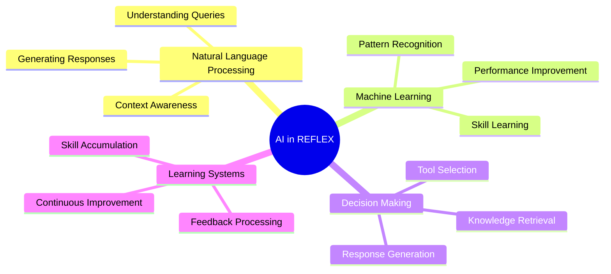

### 🧠 Large Language Models (LLMs)

**What are LLMs?**
Large Language Models are AI systems trained on massive text datasets to understand and generate human-like text. They can perform tasks like answering questions, writing code, summarizing documents, and more.

**Why We Use LLMs:**
- **Language Understanding**: LLMs excel at understanding context and nuance in human language
- **Knowledge Base**: Pre-trained LLMs contain vast amounts of information
- **Flexibility**: Can handle diverse queries without task-specific training
- **Generation**: Can produce coherent, well-structured responses

**How We Use It in REFLEX:**
We use **Claude Sonnet 4** (Anthropic's LLM) as the core reasoning engine. The LLM:
- Processes user queries and context
- Generates research responses
- Uses tools (web search, knowledge base) when needed
- Maintains conversation context across messages

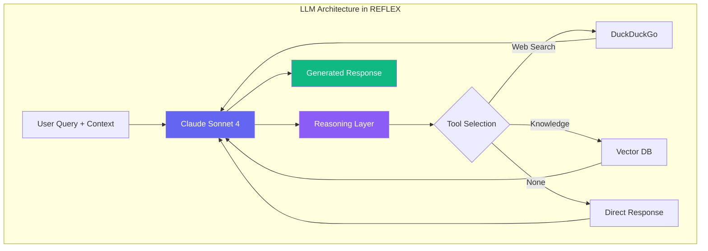

**Why Claude Sonnet 4?**
- **Advanced Reasoning**: Superior reasoning capabilities for research tasks
- **Long Context**: Can handle long conversations and documents
- **Safety**: Built with safety considerations
- **Performance**: Excellent balance of speed and quality

### 🤖 AI Agents

**What are AI Agents?**
AI Agents are autonomous systems that can perceive their environment, make decisions, and take actions to achieve goals. Unlike simple chatbots, agents can use tools, access external information, and maintain memory across interactions.

**Why We Use Agents:**
- **Tool Usage**: Agents can use external tools (web search, databases) beyond just text generation
- **Memory**: Agents maintain context and learn from past interactions
- **Autonomy**: Agents can make decisions about which tools to use and how to approach tasks
- **Self-Improvement**: Agents can learn and adapt based on feedback

**How We Use It in REFLEX:**
We use the **Agno v2** framework to create our research agent. The agent:
- Receives user queries
- Decides which tools to use (web search, knowledge base)
- Retrieves relevant information
- Generates comprehensive responses
- Learns from feedback to improve over time

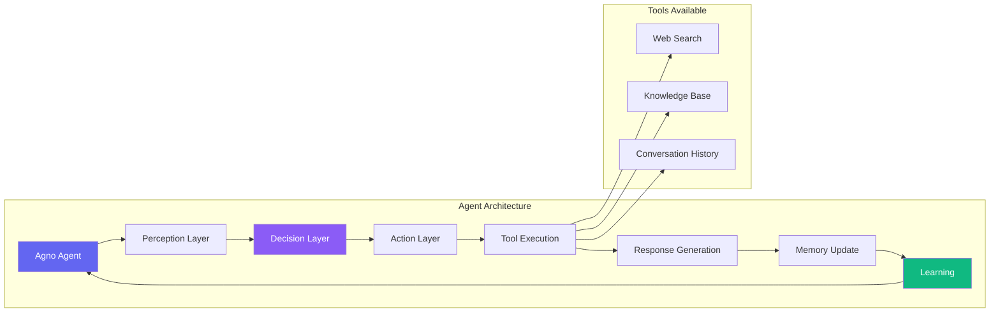

**Why Agno Framework?**
- **Modern Design**: Built for 2025 with latest best practices
- **Tool Integration**: Easy integration of external tools
- **Memory Management**: Built-in conversation history and context management
- **Flexibility**: Supports multiple LLM providers and configurations

### 🎯 Reinforcement Learning (RL)

**What is Reinforcement Learning?**
Reinforcement Learning is a machine learning paradigm where an agent learns to make decisions by interacting with an environment and receiving rewards or penalties for its actions. The agent's goal is to maximize cumulative reward over time.

**Why We Use RL:**
- **Self-Improvement**: RL allows the agent to improve its performance based on feedback
- **Adaptation**: The agent learns which strategies work best for different types of queries
- **Optimization**: RL optimizes the agent's behavior to maximize user satisfaction
- **Skill Learning**: RL helps the agent learn and refine skills over time

**How We Use It in REFLEX:**
We implement a GRPO-style (Group Relative Policy Optimization) RL approach:
1. **Trajectory Collection**: Store agent actions and responses
2. **Reward Signal**: Calculate rewards from user feedback (task success, quality, efficiency)
3. **Advantage Computation**: Compute advantages for different actions/skills
4. **Policy Update**: Boost successful skills and strategies
5. **Agent Recreation**: Update the agent with improved skills

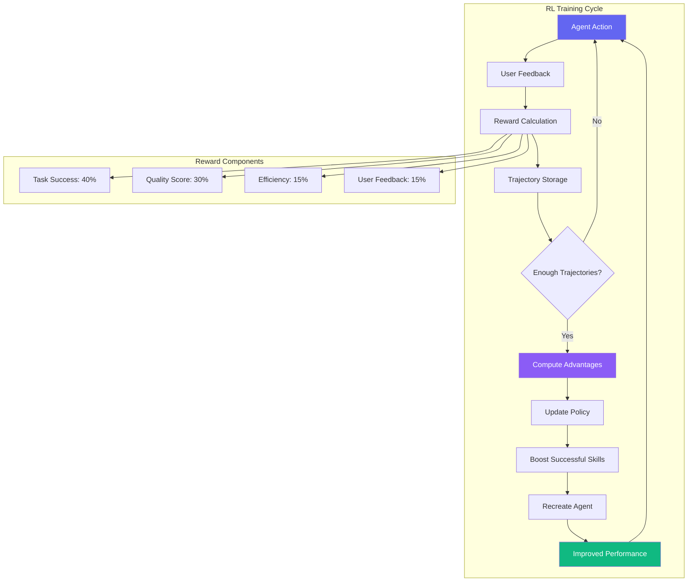

**Why GRPO-Style RL?**
- **Simplicity**: Easier to implement than complex RL algorithms
- **Effectiveness**: Works well for skill-based learning
- **Interpretability**: Clear connection between feedback and improvements
- **Efficiency**: Doesn't require massive compute resources

### 🎓 Reinforcement Learning from Human Feedback (RLHF)

**What is RLHF?**
Reinforcement Learning from Human Feedback is a technique where an AI system learns from human-provided feedback rather than predefined rewards. Humans evaluate the AI's outputs, and the system learns to produce outputs that humans prefer.

**Why We Use RLHF:**
- **Human-Aligned**: Ensures the agent improves in ways that matter to users
- **Quality Focus**: Human feedback captures nuanced quality aspects
- **Customization**: Allows users to shape the agent's behavior
- **Real-World Performance**: Better reflects real-world usage than synthetic rewards

**How We Use It in REFLEX:**
Users provide feedback through sliders and ratings:
- **Task Success**: Did the agent complete the task?
- **Quality**: How good was the response?
- **Efficiency**: How efficiently did the agent work?
- **User Feedback**: Overall satisfaction

This feedback is converted into a reward signal that guides the agent's learning.

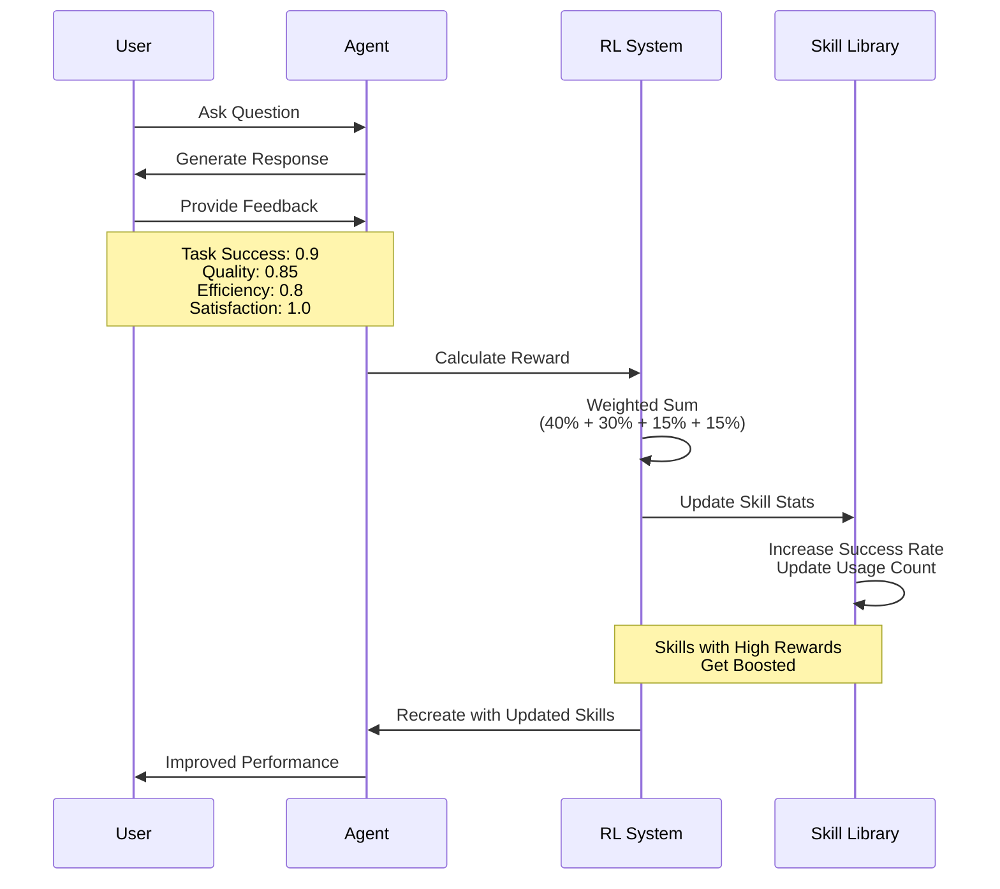

**Why RLHF Over Pure RL?**
- **User-Centric**: Learning is directly aligned with user preferences
- **Practical**: Works with real user interactions, not simulated environments
- **Flexible**: Can adapt to different user needs and preferences
- **Transparent**: Users can see and control how the agent learns

### 🔍 Retrieval Augmented Generation (RAG)

**What is RAG?**
Retrieval Augmented Generation is a technique that enhances LLM responses by retrieving relevant information from a knowledge base before generating a response. This allows LLMs to access up-to-date, domain-specific information beyond their training data.

**Why We Use RAG:**
- **Current Information**: Access to real-time and up-to-date information
- **Domain Expertise**: Can incorporate specialized knowledge
- **Accuracy**: Reduces hallucinations by grounding responses in retrieved facts
- **Scalability**: Can add new knowledge without retraining the LLM
- **Customization**: Users can add their own knowledge sources

**How We Use It in REFLEX:**
We implement RAG using:
1. **Vector Database (LanceDB)**: Stores document embeddings for fast similarity search
2. **Embeddings (OpenAI)**: Converts text into vector representations
3. **Hybrid Search**: Combines semantic and keyword search for better results
4. **Knowledge Base**: User-manageable collection of URLs and documents

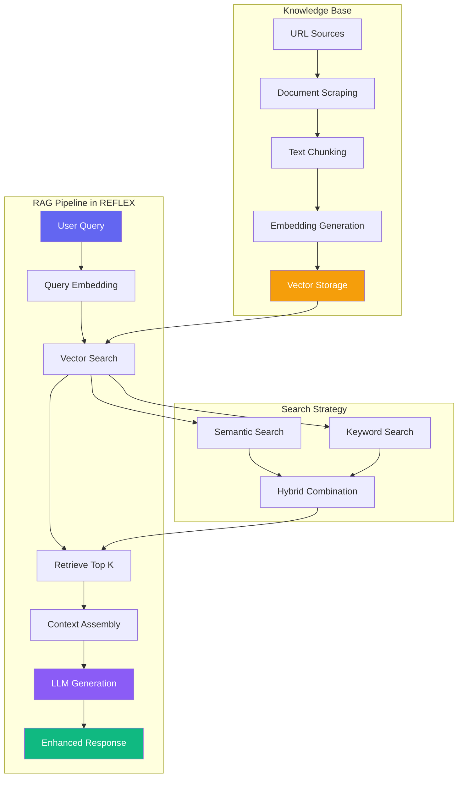

**Why LanceDB?**
- **Performance**: Fast vector search with hybrid capabilities
- **Simplicity**: Easy to integrate and manage
- **Scalability**: Handles growing knowledge bases efficiently
- **Open Source**: Free and actively maintained

**Why Hybrid Search?**
- **Semantic Understanding**: Finds conceptually similar content
- **Keyword Matching**: Catches exact terms and phrases
- **Better Coverage**: Combines strengths of both approaches
- **Improved Relevance**: More accurate retrieval results

### 🧩 How Concepts Work Together

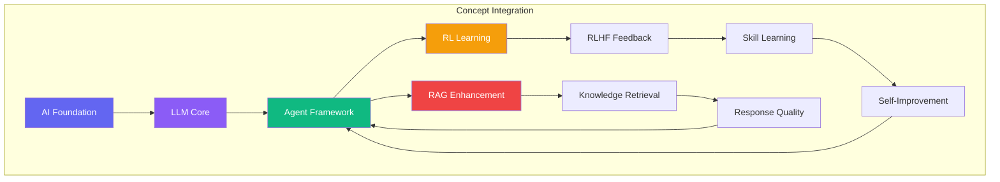

**The Complete Flow:**
1. **User Query** → AI Agent receives natural language input
2. **LLM Processing** → Claude processes the query with context
3. **RAG Retrieval** → Relevant knowledge is retrieved from vector DB
4. **Tool Usage** → Agent decides to use web search if needed
5. **Response Generation** → LLM generates comprehensive answer
6. **User Feedback** → User provides RLHF feedback
7. **RL Learning** → Agent learns from feedback using RL
8. **Skill Update** → Successful strategies become skills
9. **Continuous Improvement** → Agent gets better over time

### 🎯 Why This Architecture?

**Modularity**: Each component (LLM, RAG, RL) can be improved independently

**Scalability**: Can handle growing knowledge bases and user bases

**Flexibility**: Easy to add new tools, knowledge sources, or learning methods

**User Control**: Users can manage knowledge base and provide direct feedback

**Transparency**: Clear separation of concerns makes the system understandable

## 🎯 Key Components

### System Architecture

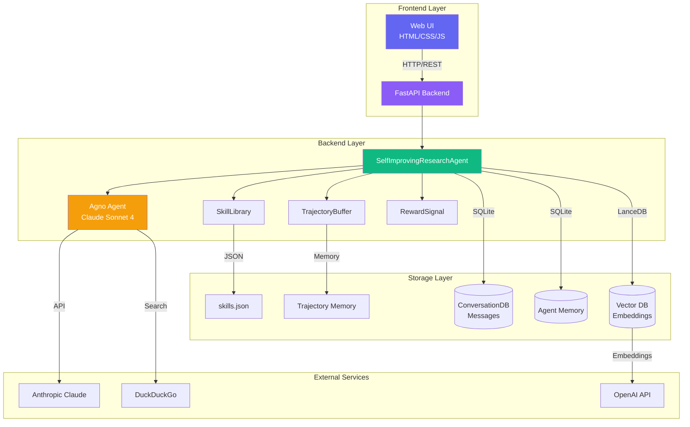

### Data Flow Diagram

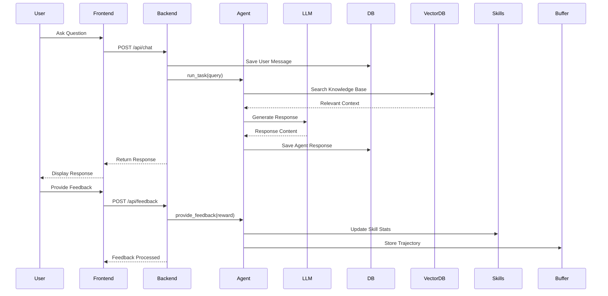

### Reinforcement Learning Training Loop

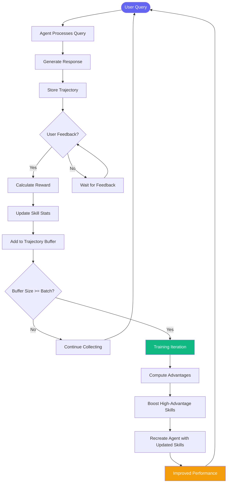

### Component Interaction Diagram

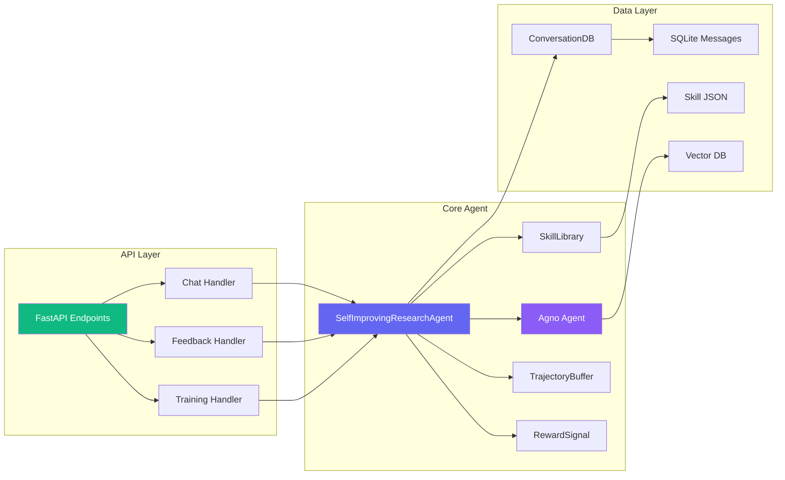

### User Journey Flowchart

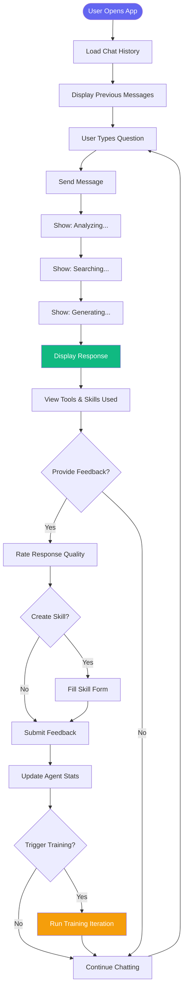

### Database Schema

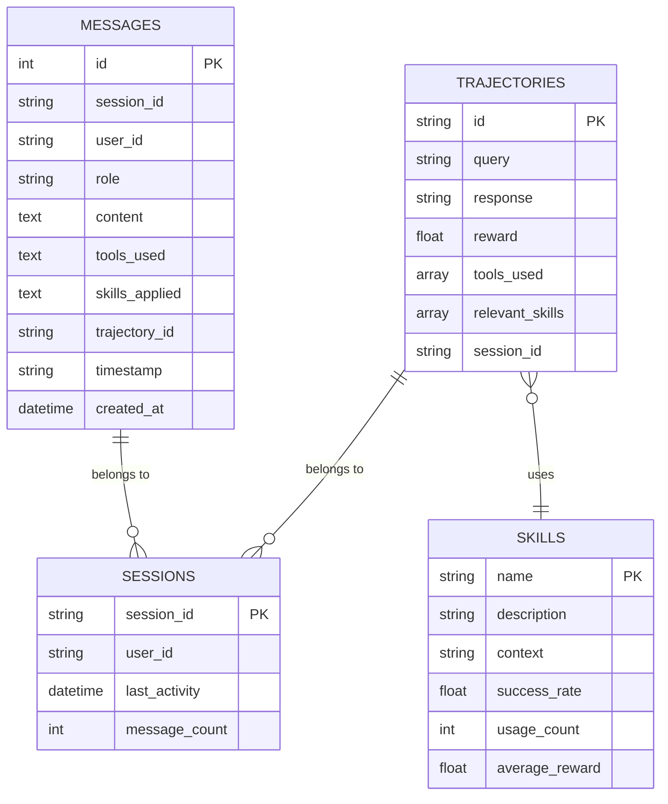

### Deployment Architecture

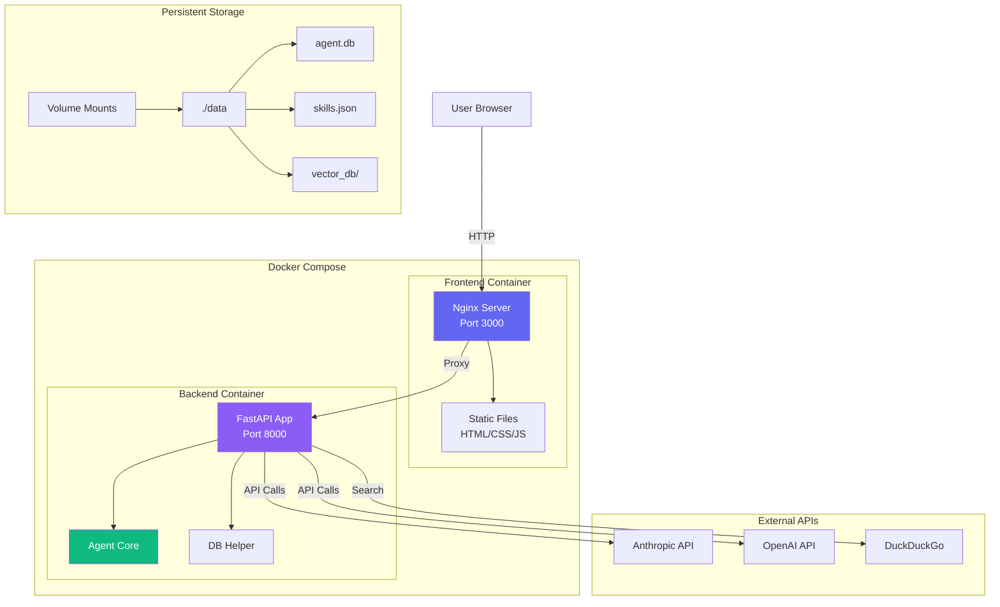

### Skill Learning Mindmap

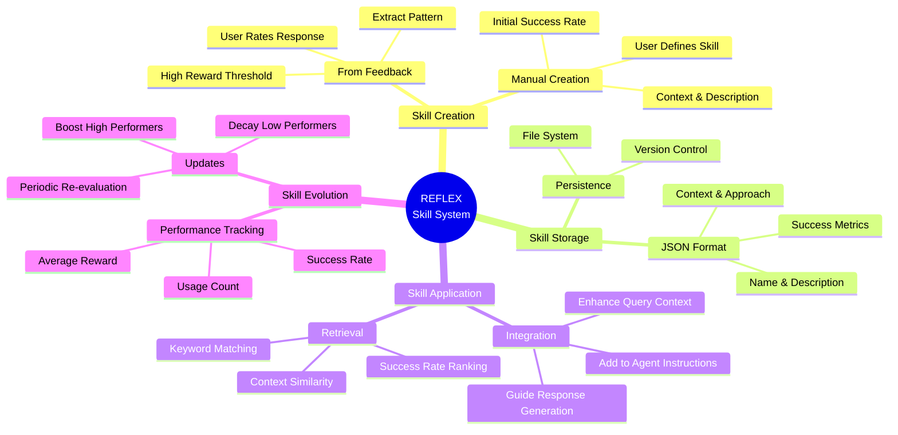

## 🔬 How It Works

### Self-Improvement Loop

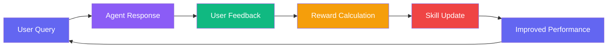

### RAG Pipeline Flow

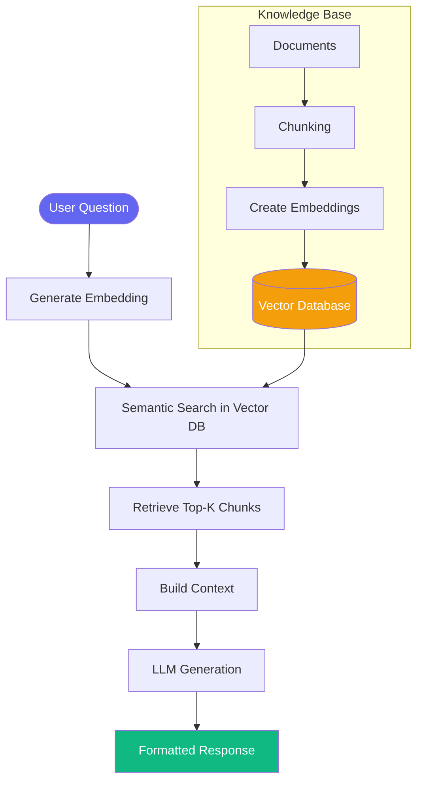

### Conversation Context Flow

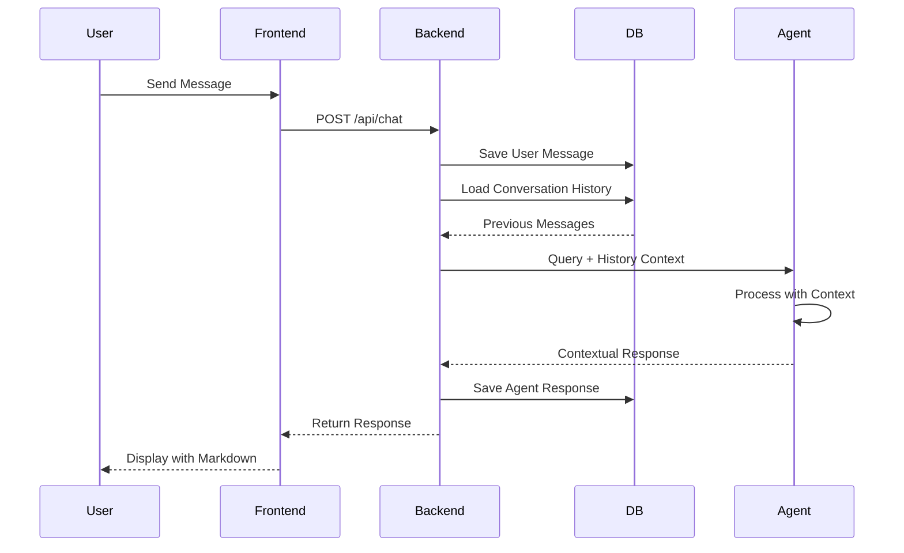

## 🎨 UI Features

### Chat Interface
- ✅ Real-time message streaming
- ✅ Markdown formatting
- ✅ Tool call visibility
- ✅ Skill usage display
- ✅ **Thinking Process**: Collapsible step-by-step reasoning view
- ✅ **Temporal Context**: Shows current datetime in prompts
- ✅ Loading indicators
- ✅ Auto-scroll

### Training Dashboard
- ✅ Total tasks counter
- ✅ Success rate percentage
- ✅ Average reward display
- ✅ Skill count tracker
- ✅ Top skills list
- ✅ Live updates

### Feedback Panel
- ✅ Multi-dimensional rating sliders
- ✅ Real-time value display
- ✅ Skill creation form
- ✅ Submit confirmation
- ✅ Status messages

### Skills Modal
- ✅ Searchable skill list
- ✅ Detailed skill cards
- ✅ Success rate badges
- ✅ Usage statistics
- ✅ Reward history

## 🐛 Troubleshooting

### Common Issues

**1. Agent not starting**
```bash
# Check API keys
cat backend/.env

# Verify installation
pip list | grep agno

# Check logs
cd backend
python -m main
```

**2. Knowledge base errors**
```
Solution: Comment out knowledge.load() after first run
Location: backend/agent_core.py line ~140
```

**3. Frontend not connecting**
```bash
# Verify backend is running
curl http://localhost:8000/api/health

# Check CORS settings
# Should see "allow_origins: ['*']" in backend/main.py

# Try different port
python3 -m http.server 8080
```

**4. Database locked errors**
```bash
# Clear databases
rm -rf data/db/*

# Restart application
./run.sh
```

**5. Module not found errors**
```bash
# Reinstall dependencies
cd backend
source venv/bin/activate
pip install --upgrade -r requirements.txt
```

### Performance Issues

**Slow responses:**
- Reduce knowledge base size
- Use smaller embedding model
- Disable web search for testing
- Increase batch processing

**High memory usage:**
- Limit trajectory buffer size (line 51 in agent_core.py)
- Clear old sessions periodically
- Use PostgreSQL instead of SQLite for production

## 🚀 Production Deployment

### Backend

**1. Use Production Server**
```bash
pip install gunicorn
gunicorn main:app -w 4 -k uvicorn.workers.UvicornWorker --bind 0.0.0.0:8000
```

**2. Environment Variables**
```bash
export ANTHROPIC_API_KEY=...
export OPENAI_API_KEY=...
export DATABASE_URL=postgresql://...
```

**3. Database Migration**
Replace SQLite with PostgreSQL:
```python
from agno.db.postgres import PostgresDb

db = PostgresDb(
    table_name="agent_sessions",
    db_url=os.getenv("DATABASE_URL")
)
```

### Frontend

**1. Build for Production**
- Minify CSS/JS
- Enable compression
- Add caching headers
- Use CDN for static assets

**2. Deploy Options**
- Vercel (frontend)
- Railway (backend + DB)
- AWS (EC2 + RDS)
- Docker (containerized)

### Docker Deployment

**Dockerfile** (backend):
```dockerfile
FROM python:3.10-slim
WORKDIR /app
COPY requirements.txt .
RUN pip install -r requirements.txt
COPY . .
CMD ["uvicorn", "main:app", "--host", "0.0.0.0", "--port", "8000"]
```

**docker-compose.yml**:
```yaml
version: '3.8'
services:
  backend:
    build: ./backend
    ports:
      - "8000:8000"
    environment:
      - ANTHROPIC_API_KEY=${ANTHROPIC_API_KEY}
      - OPENAI_API_KEY=${OPENAI_API_KEY}
    volumes:
      - ./data:/app/data
  
  frontend:
    image: nginx:alpine
    ports:
      - "3000:80"
    volumes:
      - ./frontend:/usr/share/nginx/html
```

## 📊 Monitoring

### Logs

**Backend logs:**
```bash
tail -f backend/logs/app.log
```

**Access logs:**
```bash
tail -f backend/logs/access.log
```

### Metrics

**Key metrics to track:**
- Success rate trend
- Average reward over time
- Skill accumulation rate
- Response latency
- Error rate

**Prometheus integration:**
```python
from prometheus_client import Counter, Histogram

task_counter = Counter('agent_tasks_total', 'Total tasks')
reward_histogram = Histogram('agent_reward', 'Task rewards')
```

## 🧪 Testing

**Run tests:**
```bash
cd backend
pytest tests/
```

**Manual testing:**
```bash
# Health check
curl http://localhost:8000/api/health

# Chat test
curl -X POST http://localhost:8000/api/chat \
  -H "Content-Type: application/json" \
  -d '{"message": "test", "session_id": "test"}'

# Stats test
curl http://localhost:8000/api/stats
```

## 🤝 Contributing

1. Fork the repository
2. Create feature branch (`git checkout -b feature/amazing`)
3. Commit changes (`git commit -m 'Add amazing feature'`)
4. Push to branch (`git push origin feature/amazing`)
5. Open Pull Request

## 📄 License

MIT License - see LICENSE file

## 🙏 Acknowledgments

- **Agno Team**: For the excellent agent framework
- **Anthropic**: For Claude API
- **DeepSeek/Qwen**: For RL research (GRPO/GSPO)
- **Community**: For feedback and contributions

## 📚 Resources

- [Agno Documentation](https://docs.agno.com)
- [FastAPI Documentation](https://fastapi.tiangolo.com)
- [Claude API Docs](https://docs.anthropic.com)
- [GRPO Paper](https://arxiv.org/abs/2402.03300)
- [SAGE Paper](https://arxiv.org/abs/2410.01952)

## 📧 Support

- Issues: [GitHub Issues](your-repo/issues)
- Discussions: [GitHub Discussions](your-repo/discussions)
- Email: support@example.com

---

**Built with ❤️ using Agno v2, FastAPI, and modern web technologies**

**Star ⭐ this repo if you find it useful!**

